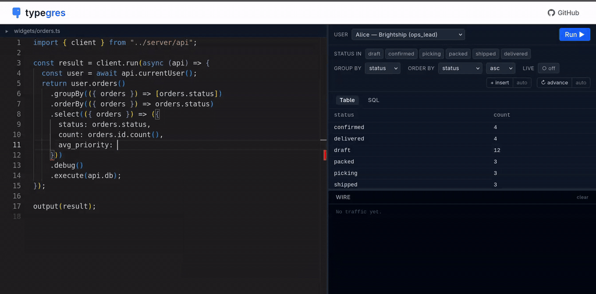

# Typegres



- **Methods on Postgres tables = your API.** No routes. No GraphQL. No auto-CRUD.
- **Every Postgres function, fully typed.** All 77 base types, every operator, nullability tracked at the type level.
- **Clients compose typed SQL across the wire.** Server validates the surface area you expose.
- **Live by default.** `.live()` re-queries when the underlying data changes — pushed directly to clients.

> [typegres.com/play](https://typegres.com/play) · [demo.mp4](./assets/demo.mp4) · [docs/ARCHITECTURE.md](./docs/ARCHITECTURE.md)

## Usage

> **Developer preview** — surface is settled, edges still being filed. Not
> yet recommended for production.

```bash
npm install typegres pg
```

```typescript
import { typegres, Int8, Text, expose } from "typegres";

const { db, conn } = await typegres({
  type: "pg",
  connectionString: process.env.DATABASE_URL!,
});

class Users extends db.Table("users") {
  @expose() id = (Int8<1>).column({ nonNull: true, generated: true });
  @expose() first_name = (Text<1>).column({ nonNull: true });
  @expose() last_name = (Text<1>).column({ nonNull: true });

  // Derived column — composes back into your typed query API.
  @expose() fullName() {
    return this.first_name["||"](" ")["||"](this.last_name);
  }
}

// `fullName()` works anywhere a column does — select, where, orderBy:
const rows = await Users.from()
  .select(({ users }) => ({
    id: users.id,
    name: users.fullName(),
  }))
  .execute(conn);

console.log(rows);
await conn.close();
```

For a complete scaffold with migrations + codegen, see
[`examples/basic`](./examples/basic). Or try it interactively at
[typegres.com/play](https://typegres.com/play).

## How it works

1. **Types codegen'd from the Postgres catalog.** 77 base types, full
   method/operator coverage, nullability tracked at the type level.
2. **Object-capability queries.** Clients can only reach what you've exposed
   as `@expose` methods — columns, relations, scoped reads, mutations. The class
   surface is the contract; the schema underneath is free to move.
3. **Object-capability RPC.** The query builder ships to a constrained
   interpreter on the server; only `@expose`-marked methods reach evaluation.
4. **Live queries.** `.live()` watches the predicates your query depends
   on and re-yields when committed mutations would change the result.

Deeper dive in [docs/ARCHITECTURE.md](./docs/ARCHITECTURE.md).

## Status

- [x] Full pg type system + operator/function codegen
- [x] Query builder (`.select` + `.join` + `.where` + `.groupBy` + `.having` + `.orderBy` + `.limit`)
- [x] Mutations (`.insert` / `.update` / `.delete` / `.returning`)
- [x] Subqueries, scalar/array aggregation
- [x] Table codegen from live schema
- [x] Live queries — `.live()` returns an async iterable that
      re-yields when committed mutations would change the result
- [x] Capability-rooted RPC — closures composed against `@expose`-marked
      classes/methods are serialized, evaluated server-side under a
      constrained interpreter, and JSON-streamed back

## Planned

- [ ] SQLite backend (sql-builder is dialect-aware; adapter is stubbed)
- [ ] `pg_notify`-driven live updates (currently a single shared polling loop, not per-subscription)
- [ ] WAL-mode for live updates (currently uses an auxiliary table)
- [ ] Cap'n Web transport (in-flight upstream PR;
      [cloudflare/capnweb#162](https://github.com/cloudflare/capnweb/pull/162))

## Development

> Recommended: [Nix the package manager](https://nixos.org/download/)
> + [direnv](https://direnv.net). The `.envrc` (`use flake`) auto-activates
> the pinned toolchain when you `cd` into the repo, and `bin/startpg`
> works out of the box. Without Nix, point `DATABASE_URL` at any local
> Postgres and skip `startpg`.

```bash
./bin/startpg             # one-time dev Postgres socket (Nix)
npm install
npm run check             # lint + typecheck + tests
```

## License

MIT — see [LICENSE](./LICENSE).
