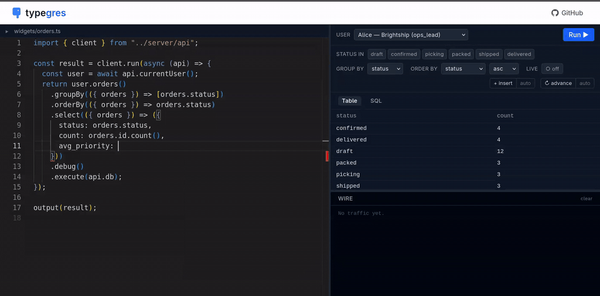

# Typegres



- **Methods on your tables = your API.** No routes. No GraphQL. No auto-CRUD.
- **Every Postgres/SQLite function, fully typed.** All base types, every operator,
  nullability tracked at the type level.
- **Clients compose typed SQL across the wire.** Server validates the surface
  area you expose.
- **Live by default.** `.live()` re-queries when the underlying data changes — pushed directly to clients.

> [typegres.com/play](https://typegres.com/play) · [demo.mp4](./assets/demo.mp4) · [docs/ARCHITECTURE.md](./docs/ARCHITECTURE.md)

## Usage

> **Developer preview** — surface is settled, edges still being filed. Not
> yet recommended for production.

```bash
npm install typegres better-sqlite3
```

```typescript
import { typegres, expose, sql } from "typegres";
import { SqliteDriver } from "typegres/drivers/sqlite";
import { Integer, Text } from "typegres/sqlite";

const db = typegres();
const conn = db.connect(SqliteDriver.create());

await conn.execute(sql`CREATE TABLE users (
  id         INTEGER PRIMARY KEY,
  first_name TEXT NOT NULL,
  last_name  TEXT NOT NULL
)`);

class Users extends db.Table("users") {
  @expose() id = Integer.column({ nonNull: true, generated: true });
  @expose() first_name = Text.column({ nonNull: true });
  @expose() last_name = Text.column({ nonNull: true });

  // Derived column — composes back into your typed query API.
  @expose() fullName() {
    return this.first_name["||"](" ")["||"](this.last_name);
  }
}

await Users.insert(
  { first_name: "Alice", last_name: "Smith" },
  { first_name: "Bob", last_name: "Jones" },
).execute(conn);

// `fullName()` works anywhere a column does — select, where, orderBy:
const rows = await Users.from()
  .select(({ users }) => ({
    id: users.id,
    name: users.fullName(),
  }))
  .execute(conn);

console.log(rows);
await conn.close();
```

For a complete scaffold with migrations + codegen, see the
[examples](#examples). Or try it interactively at
[typegres.com/play](https://typegres.com/play).

## Backends

`typegres()` is a synchronous schema handle — no top-level await, so table
classes can be declared at module load. The backend arrives separately via
`db.connect(driver)`, and the same schema classes and query builder run
against any of them:

```typescript
import { PgDriver }       from "typegres/drivers/pg";      // node-postgres
import { PgliteDriver }   from "typegres/drivers/pglite";  // in-process WASM Postgres
import { SqliteDriver }   from "typegres/drivers/sqlite";  // better-sqlite3
import { DoSqliteDriver } from "typegres/drivers/do";      // Cloudflare Durable Object

const db = typegres();

// Pick the one you're running against — the driver names the backend, and
// `db` takes its dialect from it:
db.connect(PgDriver.create(process.env.DATABASE_URL!));
db.connect(await PgliteDriver.create());          // the one async driver: booting WASM is real I/O
db.connect(SqliteDriver.create("dev.db"));        // omit the filename for :memory:
db.connect(DoSqliteDriver.create(ctx.storage));   // in the DO constructor — no npm peer needed
```

Drivers are imported explicitly from `typegres/drivers/*` so optional peers
stay out of bundles that never use them — install only the one you need.

With exactly one connection (the Durable Object model), it's also the
default: `.execute()` / `.live()` take no argument, and you can ignore what
`connect` returns. Pass a `Connection` explicitly when you have several —
read replicas, database-per-tenant, or a transaction's `tx`. Several is fine
as long as they agree on dialect; the schema classes compiled against one.

## How it works

1. **Types codegen'd from the engine itself.** Postgres from its catalog,
   SQLite from its docs — all base types, full method/operator coverage,
   nullability tracked at the type level.
2. **Object-capability queries.** Clients can only reach what you've exposed
   as `@expose` methods — columns, relations, scoped reads, mutations. The class
   surface is the contract; the schema underneath is free to move.
3. **Object-capability RPC.** The query builder ships to a constrained
   interpreter on the server; only `@expose`-marked methods reach evaluation.
4. **Live queries.** Tables opt in with `db.Table("name", { live: true })`.
   `.live()` watches the predicates your query depends on and re-yields when
   committed mutations would change the result — via a polling bus on
   Postgres, and synchronous mutation capture on SQLite.

Deeper dive in [docs/ARCHITECTURE.md](./docs/ARCHITECTURE.md).

## Examples

- [`examples/basic`](./examples/basic) — Postgres/PGLite scaffold:
  migrations, `tg generate` codegen, relations (`Relation.belongsTo` / `.has`).
- [`examples/sqlite`](./examples/sqlite) — the same scaffold on
  better-sqlite3.
- [`examples/chat`](./examples/chat) — full-stack chat on a Cloudflare
  Durable Object: SQLite storage, Cap'n Web RPC from the browser, live
  queries pushed to clients, and facet-based capability security (the whole
  server is the schema — there are no routes).

## Status

- [x] Full pg type system + operator/function codegen
- [x] SQLite dialect — typed function/operator surface from the same
      codegen; drivers for better-sqlite3 and Durable Objects
- [x] Query builder (`.select` + `.join` + `.where` + `.groupBy` + `.having` + `.orderBy` + `.limit`)
- [x] Mutations (`.insert` / `.update` / `.delete` / `.returning`)
- [x] Subqueries, scalar/array aggregation
- [x] Table codegen from live schema (`tg generate`, both dialects)
- [x] Live queries — `.live()` returns a `LiveQuery`: an async iterable you
      can also `.observe()` for push delivery (including over RPC)
- [x] Capability-rooted RPC — closures composed against `@expose`-marked
      classes/methods are serialized, evaluated server-side under a
      constrained interpreter, and streamed back
- [x] Cap'n Web transport (`typegres/capnweb`) — capabilities, promises, and
      live subscriptions over a single WebSocket

## Planned

- [ ] `pg_notify`-driven live updates (Postgres currently uses a single shared polling loop, not per-subscription)
- [ ] WAL-mode live updates for Postgres (currently uses an auxiliary table)
- [ ] Upstream the Cap'n Web integration (in-tree shim today;
      [cloudflare/capnweb#162](https://github.com/cloudflare/capnweb/pull/162))

## Development

> Recommended: [Nix the package manager](https://nixos.org/download/)
> + [direnv](https://direnv.net). The `.envrc` (`use flake`) auto-activates
> the pinned toolchain when you `cd` into the repo, and `bin/startpg`
> works out of the box. Without Nix, point `DATABASE_URL` at any local
> Postgres and skip `startpg`.

```bash
./bin/startpg             # one-time dev Postgres socket (Nix)
npm install
npm run check             # lint + typecheck + tests
```

## License

MIT — see [LICENSE](./LICENSE).
